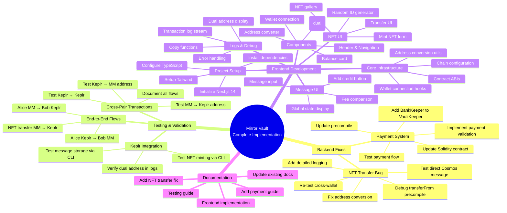

# Mirror Vault - Implementation Plan & Task Mind Map

**Date:** February 16, 2026  
**Purpose:** Structured plan to complete all 13 requirements  
**Estimated Total Time:** 3-4 weeks

---

## 🎯 Implementation Strategy



---

## 📅 Phase Breakdown

### **Phase 1: Critical Backend Fixes** (3-4 days)

Fix blocking issues that prevent proper functionality.

#### Task 1.1: Implement Payment Requirement ⚠️ HIGH PRIORITY
**Requirement:** #5 - Need 1 MIRROR token to unlock

**Sub-tasks:**
1. ☐ Add BankKeeper interface to x/vault/types
2. ☐ Update VaultKeeper constructor with BankKeeper
3. ☐ Implement `AddCreditWithPayment()` keeper function
4. ☐ Update payToUnlock precompile to validate payment
5. ☐ Make VaultGate.sol payToUnlock() payable
6. ☐ Update app.go to pass BankKeeper to VaultKeeper
7. ☐ Write test: attempt unlock with 0 balance (should fail)
8. ☐ Write test: attempt unlock with 1 MIRROR (should succeed)
9. ☐ Document payment flow in VAULT_PAYMENT.md

**Files to Modify:**
```
chain/x/vault/types/expected_keepers.go      [CREATE]
chain/x/vault/keeper/keeper.go               [MODIFY]
chain/x/vault/keeper/payment.go              [CREATE]
chain/x/vault/precompile/vault_precompile.go [MODIFY]
chain/app/app.go                             [MODIFY]
contracts/contracts/VaultGate.sol            [MODIFY]
contracts/scripts/test-payment.ts            [CREATE]
docs/VAULT_PAYMENT.md                        [CREATE]
```

**Estimated Time:** 1.5 days

---

#### Task 1.2: Fix NFT Transfer Bug ⚠️ HIGH PRIORITY
**Requirement:** #8 - NFT unification across wallets

**Sub-tasks:**
1. ☐ Add detailed logging to transferFrom precompile
2. ☐ Test direct Cosmos message: `mirrorvaultd tx nft transfer`
3. ☐ Verify address conversion (from/to EVM ↔ Cosmos)
4. ☐ Check ownership validation logic
5. ☐ Add unit test for TransferNFT keeper function
6. ☐ Fix precompile logic based on findings
7. ☐ Test MetaMask → MetaMask transfer
8. ☐ Test Keplr → Keplr transfer (CLI)
9. ☐ Test cross-wallet transfer
10. ☐ Document fix in NFT_TRANSFER_FIX.md

**Files to Modify:**
```
chain/x/nft/precompile/nft_precompile.go     [MODIFY]
chain/x/nft/keeper/keeper_test.go            [CREATE]
contracts/scripts/test-nft-transfer.ts       [CREATE]
docs/NFT_TRANSFER_FIX.md                     [CREATE]
```

**Debugging Steps:**
```bash
# 1. Test Cosmos message directly
./mirrorvaultd tx nft transfer 7421 mirror1wxc0zdcu223yl9mwswjsylwxga23m6yy8h45y8 \
  --from alice --keyring-backend test

# 2. Add debug logs to precompile
log.Info("transferFrom called", 
    "from", fromAddr, 
    "to", toAddr, 
    "tokenId", tokenId,
    "fromCosmos", fromCosmos,
    "toCosmos", toCosmos)

# 3. Query owner before/after
curl -X POST localhost:8545 --data '{
  "jsonrpc":"2.0",
  "method":"eth_call",
  "params":[{"to":"0x07587FFc...","data":"0x6352211e..."},"latest"],
  "id":1
}'
```

**Estimated Time:** 1 day

---

#### Task 1.3: Add Missing Documentation
**Sub-tasks:**
1. ☐ Create VAULT_PAYMENT.md (payment flow)
2. ☐ Create NFT_TRANSFER_FIX.md (bug resolution)
3. ☐ Update REQUIREMENTS_TRACKING.md after fixes

**Estimated Time:** 0.5 days

---

### **Phase 2: Testing & Validation** (2-3 days)

Comprehensive testing of all backend functionality.

#### Task 2.1: Cross-Pair Transaction Testing
**Requirement:** #3 - All transaction combinations must work

**Test Matrix:**
| From | To | Test Command | Expected Result |
|------|-----|--------------|-----------------|
| MM1 | MM2 | `await signer.sendTransaction({to: bob, value})` | Bob EVM balance +N |
| MM1 | Keplr2 | `await signer.sendTransaction({to: "mirror1wxc...", value})` | Bob Cosmos balance +N |
| Keplr1 | MM2 | `mirrorvaultd tx bank send alice 0xf39Fd... 5amirror` | Bob EVM balance +N |
| Keplr1 | Keplr2 | `mirrorvaultd tx bank send alice mirror1wxc... 5amirror` | Bob Cosmos balance +N |

**Sub-tasks:**
1. ☐ Write test script: `test-cross-pair-transactions.ts`
2. ☐ Test MM → MM (already passing)
3. ☐ Test MM → Cosmos address
4. ☐ Test Cosmos → EVM address (CLI)
5. ☐ Test Cosmos → Cosmos (CLI)
6. ☐ Verify balance updates in both wallets
7. ☐ Document test results in CROSS_PAIR_TX_TESTS.md

**Files to Create:**
```
contracts/scripts/test-cross-pair-transactions.ts [CREATE]
chain/scripts/test-cosmos-transfers.sh            [CREATE]
docs/CROSS_PAIR_TX_TESTS.md                       [CREATE]
```

**Estimated Time:** 1 day

---

#### Task 2.2: Keplr Integration Testing
**Requirement:** #6 - NFT minting from Keplr

**Sub-tasks:**
1. ☐ Test message storage via Cosmos CLI
   ```bash
   # Add credit
   ./mirrorvaultd tx vault add-credit --from alice

   # Store message
   ./mirrorvaultd tx vault store-message "Hello from Keplr" --from alice
   ```
2. ☐ Test NFT minting via Cosmos CLI
   ```bash
   ./mirrorvaultd tx nft mint 12345 "ipfs://QmTest/metadata.json" --from alice
   ```
3. ☐ Verify dual address in logs
4. ☐ Query from MetaMask, verify NFT visible
5. ☐ Document Keplr CLI commands in KEPLR_CLI_GUIDE.md

**Files to Create:**
```
chain/scripts/test-keplr-integration.sh [CREATE]
docs/KEPLR_CLI_GUIDE.md                 [CREATE]
```

**Estimated Time:** 0.5 days

---

#### Task 2.3: End-to-End Flow Testing
**Sub-tasks:**
1. ☐ Alice (MM) → Bob (Keplr): Send tokens
2. ☐ Alice (Keplr) → Bob (MM): Send tokens
3. ☐ Alice (MM) mints NFT → Bob (Keplr) sees it
4. ☐ Alice (MM) transfers NFT → Bob (MM) owns it
5. ☐ Alice (Keplr) stores message → visible globally
6. ☐ Document all flows in E2E_TESTING.md

**Estimated Time:** 1 day

---

### **Phase 3: Frontend Development** (2-3 weeks)

Build Next.js UI based on FRONTEND_SPECIFICATION_V2.md.

#### Task 3.1: Project Setup (Day 1)

**Sub-tasks:**
1. ☐ Initialize Next.js 14 with App Router
   ```bash
   npx create-next-app@latest frontend \
     --typescript \
     --tailwind \
     --app \
     --no-src-dir \
     --import-alias "@/*"
   ```
2. ☐ Install dependencies
   ```bash
   npm install ethers@6 @cosmjs/stargate @cosmjs/encoding zustand sonner
   npm install -D @types/node
   ```
3. ☐ Setup directory structure
   ```
   frontend/
   ├── app/
   │   ├── layout.tsx
   │   ├── page.tsx
   │   └── globals.css
   ├── components/
   │   ├── layout/
   │   ├── wallet/
   │   ├── vault/
   │   ├── nft/
   │   └── logs/
   ├── lib/
   │   ├── chains/
   │   ├── contracts/
   │   ├── cosmos/
   │   ├── utils/
   │   └── hooks/
   └── types/
   ```
4. ☐ Configure Tailwind with design system
5. ☐ Setup TypeScript paths

**Estimated Time:** 1 day

---

#### Task 3.2: Core Infrastructure (Days 2-3)

**Sub-tasks:**
1. ☐ Create chain configuration: `lib/chains/mirrorChainConfig.ts`
2. ☐ Implement address conversion: `lib/utils/addressConversion.ts`
3. ☐ Create contract ABIs: `lib/contracts/abis.ts`
4. ☐ Setup wallet connection hook: `lib/hooks/useWallet.ts`
5. ☐ Implement auto chain-add functions
6. ☐ Create CosmJS client: `lib/cosmos/client.ts`

**Files to Create:**
```
lib/chains/mirrorChainConfig.ts       [CREATE]
lib/chains/autoAddChain.ts            [CREATE]
lib/utils/addressConversion.ts        [CREATE]
lib/utils/formatters.ts               [CREATE]
lib/contracts/VaultGate.ts            [CREATE]
lib/contracts/MirrorNFT.ts            [CREATE]
lib/cosmos/client.ts                  [CREATE]
lib/cosmos/messages.ts                [CREATE]
lib/hooks/useWallet.ts                [CREATE]
lib/hooks/useBalance.ts               [CREATE]
```

**Estimated Time:** 2 days

---

#### Task 3.3: Layout & Navigation (Day 4)

**Sub-tasks:**
1. ☐ Create Header component with wallet dropdown
2. ☐ Create wallet connection modal
3. ☐ Add chain status indicator
4. ☐ Implement responsive navigation

**Files to Create:**
```
components/layout/Header.tsx          [CREATE]
components/layout/WalletConnect.tsx   [CREATE]
components/layout/ChainStatus.tsx     [CREATE]
app/layout.tsx                        [MODIFY]
```

**Estimated Time:** 1 day

---

#### Task 3.4: Account Display (Day 5)

**Sub-tasks:**
1. ☐ Create AccountDisplay component (dual addresses)
2. ☐ Create BalanceCard (unified balance)
3. ☐ Create AddressConverter tool
4. ☐ Add copy buttons for each format
5. ☐ Add tooltip with conversion explanation

**Files to Create:**
```
components/wallet/AccountDisplay.tsx  [CREATE]
components/wallet/BalanceCard.tsx     [CREATE]
components/wallet/AddressConverter.tsx [CREATE]
```

**Estimated Time:** 1 day

---

#### Task 3.5: Message/Vault UI (Days 6-7)

**Sub-tasks:**
1. ☐ Create VaultActions component
   - Add credit button (with payment)
   - Store message input
   - Character counter
2. ☐ Create FeeComparison component
   - Estimate gas for MetaMask path
   - Estimate fees for Keplr path
   - Show recommended option
3. ☐ Create MessageHistory component
   - Display global message count
   - Show last message
   - Show last sender (both formats)
4. ☐ Implement message submission flow
5. ☐ Add loading states & error handling

**Files to Create:**
```
components/vault/VaultActions.tsx     [CREATE]
components/vault/FeeComparison.tsx    [CREATE]
components/vault/MessageHistory.tsx   [CREATE]
lib/hooks/useVault.ts                 [CREATE]
lib/utils/gasEstimation.ts            [CREATE]
```

**Estimated Time:** 2 days

---

#### Task 3.6: NFT UI (Days 8-10)

**Sub-tasks:**
1. ☐ Create MintNFT component
   - Token ID input
   - Random ID button (timestamp-based)
   - Token URI input
   - Wallet selection (MetaMask/Keplr)
2. ☐ Create NFTCard component
   - Display NFT image (from URI)
   - Show owner (both formats)
   - Show token ID
   - Transfer button
3. ☐ Create NFTGallery component
   - Grid layout (responsive)
   - Filter by owner
   - Pagination
4. ☐ Implement minting flow
5. ☐ Implement transfer flow (when fixed)

**Files to Create:**
```
components/nft/MintNFT.tsx            [CREATE]
components/nft/NFTCard.tsx            [CREATE]
components/nft/NFTGallery.tsx         [CREATE]
lib/hooks/useNFT.ts                   [CREATE]
```

**Estimated Time:** 3 days

---

#### Task 3.7: Transaction Logs (Days 11-12)

**Sub-tasks:**
1. ☐ Create TransactionLogs component
   - Terminal-style design
   - Real-time event stream
   - Auto-scroll option
2. ☐ Create LogEntry component
   - Display dual addresses
   - Show wallet used
   - Timestamp
   - TX hash with copy button
3. ☐ Implement event listeners
   - EVM events (JSON-RPC)
   - Cosmos events (WebSocket)
4. ☐ Add filtering & search

**Files to Create:**
```
components/logs/TransactionLogs.tsx   [CREATE]
components/logs/LogEntry.tsx          [CREATE]
lib/utils/eventListener.ts            [CREATE]
```

**Estimated Time:** 2 days

---

#### Task 3.8: Polish & Testing (Days 13-14)

**Sub-tasks:**
1. ☐ Add loading skeletons
2. ☐ Improve error messages
3. ☐ Add toast notifications (sonner)
4. ☐ Test responsive design (mobile, tablet, desktop)
5. ☐ Test dark mode
6. ☐ Add accessibility (WCAG 2.1 AA)
7. ☐ Write frontend README
8. ☐ Document component usage

**Files to Create:**
```
frontend/README.md                    [CREATE]
frontend/COMPONENTS.md                [CREATE]
```

**Estimated Time:** 2 days

---

### **Phase 4: Final Integration & Documentation** (2-3 days)

#### Task 4.1: Integration Testing
**Sub-tasks:**
1. ☐ Test full user journey: Connect → Add Credit → Store Message
2. ☐ Test NFT minting from UI
3. ☐ Test cross-wallet visibility
4. ☐ Test dual address in all components
5. ☐ Test error scenarios

**Estimated Time:** 1 day

---

#### Task 4.2: Documentation Updates
**Sub-tasks:**
1. ☐ Update REQUIREMENTS_TRACKING.md (mark all completed)
2. ☐ Create USER_GUIDE.md (end-user documentation)
3. ☐ Create DEVELOPER_GUIDE.md (setup instructions)
4. ☐ Update README.md with current status
5. ☐ Create VIDEO_DEMO.md (script for demo video)

**Files to Create:**
```
docs/USER_GUIDE.md                    [CREATE]
docs/DEVELOPER_GUIDE.md               [CREATE]
docs/VIDEO_DEMO.md                    [CREATE]
README.md                             [UPDATE]
```

**Estimated Time:** 1 day

---

#### Task 4.3: Deployment Preparation
**Sub-tasks:**
1. ☐ Create Docker Compose for full stack
2. ☐ Write deployment script
3. ☐ Create DEPLOYMENT.md guide
4. ☐ Test clean deployment


 **Estimated Time:** 1 day

---

## 📊 Timeline Summary

| Phase | Duration | Start | End |
|-------|----------|-------|-----|
| **Phase 1: Backend Fixes** | 3-4 days | Day 1 | Day 4 |
| **Phase 2: Testing** | 2-3 days | Day 5 | Day 7 |
| **Phase 3: Frontend** | 14 days | Day 8 | Day 21 |
| **Phase 4: Final Integration** | 2-3 days | Day 22 | Day 24 |
| **TOTAL** | **21-24 days** | Day 1 | Day 24 |

**3-4 weeks total** (depends on frontend complexity)

---

## 🎯 Success Criteria

### Backend (Phase 1-2)
- ✅ Payment requirement enforced (1 MIRROR)
- ✅ NFT transfer works cross-wallet
- ✅ All 4 cross-pair transaction types tested
- ✅ Keplr integration tested via CLI
- ✅ Dual address logging verified

### Frontend (Phase 3)
- ✅ All 13 requirements implemented in UI
- ✅ Random ID generation working
- ✅ Dual address displayed everywhere
- ✅ Search/input accepts both formats
- ✅ Matches reference implementation style
- ✅ Responsive & accessible

### Documentation (Phase 4)
- ✅ All gaps documented
- ✅ User guide complete
- ✅ Developer setup guide
- ✅ Deployment guide
- ✅ Demo video script

---

## 🚀 Quick Start (For Developers)

### Day 1: Get Started
```bash
# 1. Fix payment requirement
cd chain/x/vault
# Follow Task 1.1 sub-tasks

# 2. Fix NFT transfer
cd chain/x/nft
# Follow Task 1.2 sub-tasks

# 3. Test fixes
cd contracts
npx hardhat run scripts/test-payment.ts --network mirrorVaultLocal
```

### Week 2: Frontend
```bash
# 1. Initialize project
cd frontend
npx create-next-app@latest . --typescript --tailwind --app

# 2. Install deps
npm install ethers@6 @cosmjs/stargate zustand sonner

# 3. Copy reference implementation
# Use provided HTML/CSS/JS as design guide

# 4. Follow Task 3.1 - 3.8
```

### Week 3-4: Polish & Ship
```bash
# 1. Integration testing
npm run dev  # Frontend
./mirrorvaultd start  # Backend

# 2. Document everything
# Follow Task 4.2

# 3. Deploy
docker-compose up
```

---

## 📝 Task Checklist

Copy this to track progress:

```markdown
## Phase 1: Backend Fixes
- [ ] Task 1.1: Payment requirement (8 sub-tasks)
- [ ] Task 1.2: NFT transfer fix (10 sub-tasks)
- [ ] Task 1.3: Documentation (3 sub-tasks)

## Phase 2: Testing
- [ ] Task 2.1: Cross-pair transactions (7 sub-tasks)
- [ ] Task 2.2: Keplr integration (5 sub-tasks)
- [ ] Task 2.3: E2E flows (6 sub-tasks)

## Phase 3: Frontend
- [ ] Task 3.1: Project setup (5 sub-tasks)
- [ ] Task 3.2: Core infrastructure (6 sub-tasks)
- [ ] Task 3.3: Layout & navigation (4 sub-tasks)
- [ ] Task 3.4: Account display (5 sub-tasks)
- [ ] Task 3.5: Message/Vault UI (5 sub-tasks)
- [ ] Task 3.6: NFT UI (5 sub-tasks)
- [ ] Task 3.7: Transaction logs (4 sub-tasks)
- [ ] Task 3.8: Polish & testing (8 sub-tasks)

## Phase 4: Final
- [ ] Task 4.1: Integration testing (5 sub-tasks)
- [ ] Task 4.2: Documentation (5 sub-tasks)
- [ ] Task 4.3: Deployment (4 sub-tasks)
```

---

**Total Tasks:** 12 major tasks  
**Total Sub-tasks:** ~90 sub-tasks  
**Estimated Effort:** 3-4 weeks (1 developer)  
**Priority Order:** Payment → NFT Transfer → Testing → Frontend → Docs
